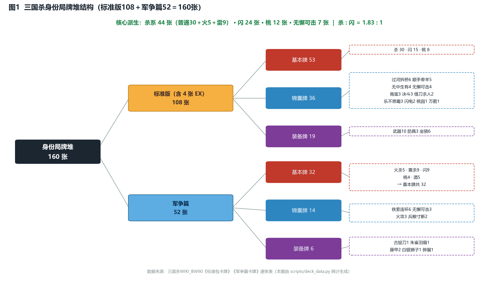
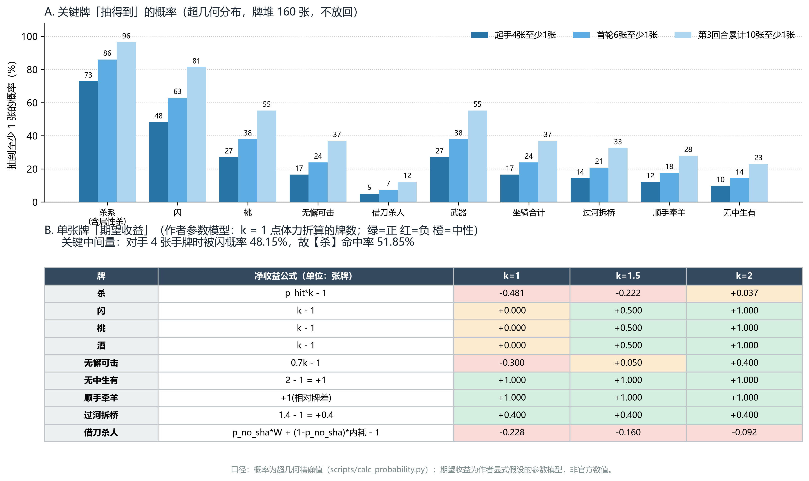
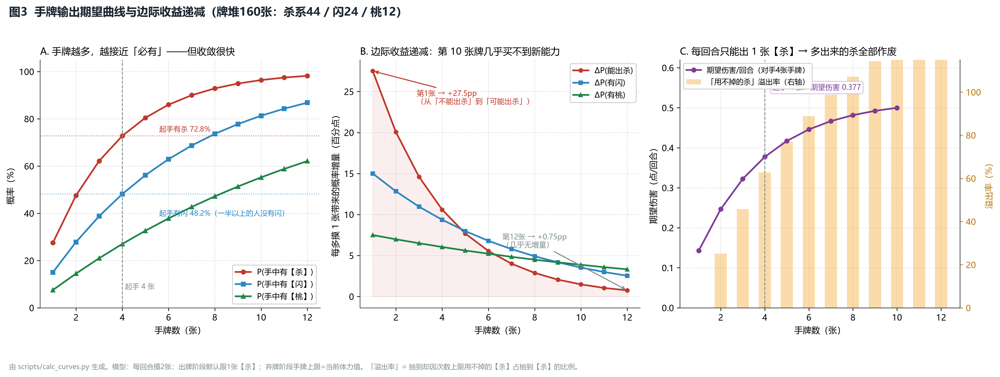
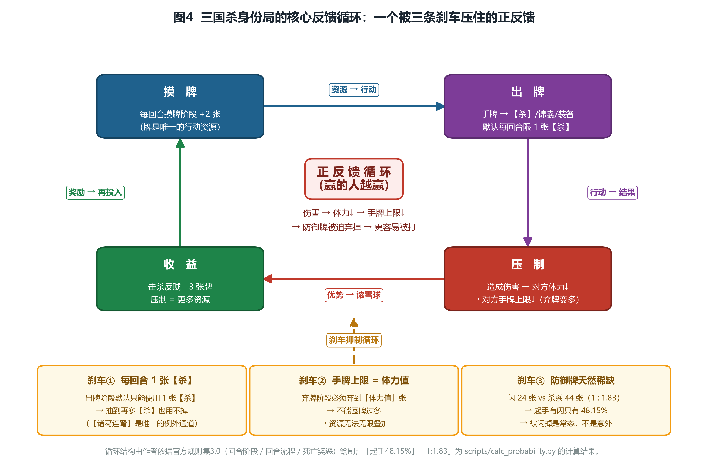
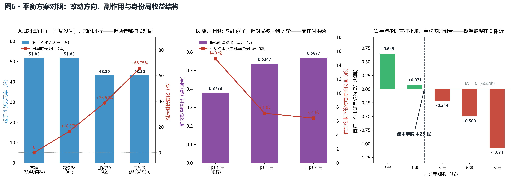
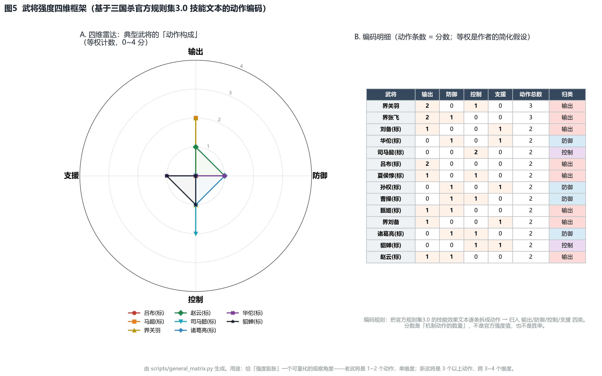

# 1 : 1.83 —— 三国杀 160 张牌堆的数值拆解：三条刹车，和三个可验证的改动实验

> **系列**：数值拆解 · 02（01 =《一张牌的定价：逆向拆解杀戮尖塔「腐化」为什么敢把技能牌变成 0 费》）
> **拆解对象**：三国杀（数据层＝桌游标准版 + 军争篇牌堆，共 160 张）
> **视角**：系统 / 数值策划的逆向工程
> **口径**：本文没有一个拍脑袋的数字——每一个都能用文末 `scripts/` 里的脚本重跑出来

> 📌 插图共 6 张，位于 `charts/`（图注已标文件名）；在知乎发布时需手动上传，本仓库内可正常显示。

---

## 摘要卡（30 秒版本）

**三个数字**：杀 : 闪 ＝ **1.83 : 1** ｜ 开局 4 张摸不到【闪】的概率 ＝ **51.85%** ｜ 一个人一回合的裸模型输出上限 ＝ **0.5185 点**

**三条结论**：
1. 三国杀不靠"砍数值"平衡，靠**三条刹车**，其中最狠的一条是**耦合的**；
2. "攻击牌太多"是观感问题，"**防御牌供给不足**"才是结构问题——这两个判断会导出完全不同的改法；
3. 把主数值天花板**压低**，机制设计才有地方长，这是它跑了十五年还没改底层的真正原因。

**一句话方法**：先找到封闭可枚举的供给池，再把每条"设计意图"翻译成一个可计算的指标，最后对每个改动先算预测与副作用、再决定动不动。

---

## 一、开局那一半人，手里没有【闪】

先说一个所有人都经历过、但几乎没人算过的画面。

8 人身份局，你摸起手 4 张牌。

**你有 51.85% 的概率，一张【闪】都没有。** 同时，**你有 72.77% 的概率手里有【杀】**。

开局就是 3 : 2 的攻守失衡，而且是**同一个人同时**握着"能打"和"不能防"这两种属性。

再往下看一层。老玩家嘴里那句"杀 : 闪 ＝ 2 : 1"其实是对的——**但只对标准版成立**（30 张杀 : 15 张闪 ＝ 2.00 : 1）。一旦把军争篇并进来，真实比值是 **44 : 24 ＝ 1.83 : 1**。

**一个扩包，把"杀 : 闪"从 2.00 稀释到 1.83。官方在扩包里，悄悄把防御面放大了。**

最后看天花板。不考虑技能、不考虑装备、不考虑队友救援——**一个人一回合的期望输出只有 0.3773 点伤害**；就算把手牌堆到 10 张，也只有 0.4999，极限是 0.5185。

`[数学推导: scripts/calc_probability.py、calc_curves.py]`

可今天的三国杀 OL／移动版，一个新武将一回合打掉 2 点、3 点伤害是家常便饭。

**于是一个问题浮出来了：一个跑了十几年的数值系统，靠什么把"开局就该打死人"这件事压了这么久？**

这篇文章分三步回答它：

1. **数值层**——把 160 张牌算成一张资产负债表（供给结构、单卡定价、输出天花板、边际递减）；
2. **系统层**——拆系统是怎么接住这些数字的（时机接口、四套目标函数、距离尺）；
3. **设计层**——**如果由我来改，我会动哪三个旋钮，以及模型告诉我哪一个不该动。**

> **口径声明（重要）**：本文**数据层是桌游牌堆**——标准版 108 张（含 4 张 EX）＋军争篇 52 张 ＝ **160 张**，逐张转录自公开卡表、由脚本自行统计。**产品锚点是《三国杀 OL》**（谈规则体系与调整史），**移动版只作对照**（谈商业化）。线上版本的牌堆构成与桌游不同，凡是可能越界的结论，我都会单独标注来源与范围。

---

## 二、基础信息（一段带过）

三国杀，游卡桌游，2008 年问世；身份推理类卡牌桌游（2~10 人），后来发展出 OL（网页／客户端）、移动版、十周年三条独立线上产品线。核心卖点＝**信息不对称的身份博弈 ＋ 卡牌数值 ＋ 武将技能组合**；商业模式＝F2P 卖武将、皮肤与抽卡。8 人身份局配置：**主公 1／忠臣 2／反贼 4／内奸 1**。

`[来源: 详见 数据底表.md §6.1、§6.2、§7（均含官方公告 URL）]`

为什么这一节这么短？因为基础信息是"体例要求"，不是"分析价值"。**下面全是干货。**

---

## 三、系统拆解：6 个阶段、4 个目标函数、1 把距离尺

### 3.1 六个阶段，其实是六个"插件槽"

三国杀的一回合是固定流水线：**准备 → 判定 → 摸牌 → 出牌 → 弃牌 → 结束**。

新手看这是"流程"；做过系统的人看，这是**六个时机接口（hook）**。

理由很直接：把 18 名标准包武将的技能触发时机逐条标出来，你会发现它们几乎全部挂在阶段开始／结束这两个点上——观星挂准备阶段、洛神挂准备阶段、闭月挂结束阶段、遗计挂受伤后。

**这就是为什么三国杀能一直加武将、却几乎不改规则。** 阶段是官方预留的插件槽，新武将＝往槽里插一个新回调。对比很多卡牌游戏"新机制要改底层结算"的窘境，这是这套系统最值钱的一处设计。

`[来源: 官方《三国杀官方规则集》3.0《游戏的流程》；技能文本同样取自规则集原文，见 数据底表.md §5]`

### 3.2 身份局：没有统一的计分板

四种身份，四个**完全不同**的胜利条件：

| 身份 | 人数（8 人局） | 胜利条件 | 收益口径 |
|---|---|---|---|
| 主公 | 1 | 消灭所有反贼与内奸 | 存活优先，误杀代价最高 |
| 忠臣 | 2 | 保护主公，与主公同胜 | 可牺牲自己，敢打敢拼 |
| 反贼 | 4 | 击杀主公 | 击杀主公＝直接胜利 |
| 内奸 | 1 | 自己活到与主公单挑并取胜 | 不是"输出最大化"，而是"存活排序" |

这张表最重要的一行信息是：**同一张牌、同一个动作，在不同身份手里的期望完全不同。** 大多数游戏的胜负是"谁的分高"；三国杀的胜负是"你有没有达成**属于你那一份**的条件"。所以牌不只是资源，**牌还是"别人用来判断你是谁"的信号**——你出一张【杀】，别人要同时算两件事：它造成了多少伤害，以及它暴露了多少身份信息。

**这句话可以量化，我放在第五章单独算。**

### 3.3 距离体系：装备不是属性加成，是"目标选择权"

距离的定义很朴素：沿座位逆／顺时针**最短路径**上的箭头数；自己与自己距离为 0，最短为 1。

但把它代入 8 人局，会得到一个很漂亮的表：

| 你的攻击范围 | 能打到几个人（共 7 人） | 覆盖全场 |
|---|---|---|
| 1（赤手） | 2 | 28.6% |
| 2 | 4 | 57.1% |
| 3 | 6 | 85.7% |
| 4 | **7** | **100%** |

8 人围坐，你和每个对手的距离分布是 1,1,2,2,3,3,4，平均 2.286。

`[数学推导: scripts/calc_probability.py → 距离与攻击范围覆盖]`

所以武器牌给你的**不是伤害，是"我能打谁"的自由度**。从 2 个人到 7 个人——这就是装备要占 25 张（15.6%）的原因，也是为什么在武将技能文本里，**"无距离限制"这五个字是官方最贵的赠品之一**：界关羽的方块杀、2025-09 官方给关羽"补距离"的调整，都在这条线上。

`[来源: 官方规则集 3.0《用语·数值·距离/攻击范围》；调整记录见 数据底表.md §6.5]`

---

## 四、数值拆解：把 160 张牌算成一张资产负债表

### 4.1 先看清供给结构

160 张 ＝ **基本牌 85 ＋ 锦囊牌 50 ＋ 装备牌 25**。关键占比：

| 牌 | 张数 | 占比 | 起手 4 张至少 1 张 |
|---|---|---|---|
| 杀系（杀 30＋火杀 5＋雷杀 9） | 44 | 27.50% | 72.77% |
| 闪 | 24 | 15.00% | 48.15% |
| 桃 | 12 | 7.50% | 27.02% |
| 无懈可击 | 7 | 4.38% | 16.53% |
| 借刀杀人 | 2 | 1.25% | 4.95% |

（概率为超几何精确解：P(X≥1) ＝ 1 − C(N−K, n) ／ C(N, n)）

***图 1 · 160 张牌堆的结构树**（作者自制，全部数据可复算）*

**一句话结论**：这张表就是三国杀的物价表——它决定了什么稀缺、什么便宜、什么根本不值得留。

### 4.2 给每张牌标个价：钱从哪来，花在哪

要谈期望，先得承认一件事：**任何"牌值多少钱"的结论，都取决于"1 点体力值几张牌"这个汇率。** 我不预设答案，直接给三档：**k ＝ 1 ／ 1.5 ／ 2**（k ＝ 1 点体力折算的牌数，是作者自建模型的**唯一自由参数**）。

k ＝ 1.5 时：

| 牌 | 公式 | 净收益（张牌） |
|---|---|---|
| 无中生有 | 2 − 1 | **+1.000** |
| 顺手牵羊 | 相对牌差 +1 | **+1.000** |
| 桃 | k − 1 | +0.500 |
| 闪 | k − 1 | +0.500 |
| 过河拆桥 | 1.4 − 1 | +0.400 |
| 无懈可击 | 0.7k − 1 | +0.050 |
| **杀** | p_hit × k − 1 | **−0.222** |
| **借刀杀人** | 见 §7.2 | **−0.160** |

***图 2 · 关键牌的出现概率与单卡期望**（作者自制）*

三个值得记住的读数：

1. **只有【无中生有】【顺手牵羊】是与 k 无关的纯赚**（+1 张牌），其余全在"换资源"——用一张牌换另一种资源，汇率一变，正负就变。
2. **【杀】在 k < 1.93 时，牌差上是亏的。** 换算成设计语言：**杀不是赚牌工具，是压迫工具。** 你花掉一张牌，买到的是"对手必须回应"这个压力，而不是牌数优势。
3. 当"1 点体力"值不到 1.93 张牌时，**全场都在赔本打仗**——这正是三国杀"打不死人"的微观原因。

`[数学推导: scripts/calc_probability.py → 单卡期望收益（作者参数模型）]`

### 4.3 "0.5185 天花板"：所有输出武将都在撞同一块玻璃

单人单回合期望输出（对手手牌固定为 4 张）：

| 我的手牌 | P(手中有杀) | 期望伤害／回合 |
|---|---|---|
| 4 | 72.77% | **0.3773** |
| 6 | 86.00% | 0.4459 |
| 8 | 92.88% | 0.4816 |
| 10 | 96.41% | 0.4999 |
| ∞（上限） | 100% | **0.5185** |

***图 3 · 手牌数 → 输出期望曲线**（作者自制）*

**0.5185 就是"裸模型天花板"**——它等于"对手 4 张手牌里有【闪】的概率"的反面，也就是**命中率的上限**。

这是个极其重要的数字。它意味着：**在这个牌堆里，"堆手牌打伤害"这条路的天花板低到几乎无法突破**——从 4 张堆到无穷多张，期望输出只从 0.3773 涨到 0.5185（+37%），而手牌量涨了无穷倍。

于是所有强输出武将——吕布的无双、许褚的裸衣、黄忠的烈弓、张飞的连杀——**它们的本质都不是"伤害更高"，而是"绕过这道天花板"**：改命中（无双强制出两张闪）、改次数（连杀）、改条件（烈弓）。

**一句话结论**：主数值天花板定得越低，机制设计能长的地方就越多。这是三国杀最聪明的一处"自我设限"。

### 4.4 边际递减：为什么"多摸牌"救不了老武将

把"每回合只能出 1 张【杀】"这条规则叠上去，溢出率就出现了：

| 手牌数 | 期望手里的杀 | 期望有效使用的杀 | 溢出率 |
|---|---|---|---|
| 4 | 1.10 | 0.73 | **33.85%** |
| 8 | 2.20 | 0.93 | 57.78% |
| 12 | 3.30 | 0.98 | **70.24%** |

逐张边际：**第 1 张牌对"能出杀"的边际贡献是 +27.50 个百分点；第 12 张只有 +0.75 个百分点。**

这就是"过牌流救老武将"这个思路的天花板：**摸牌的价值前段陡、后段平**——摸到手牌 10 张以上，六成半以上的【杀】是废牌。

所以后出的武将要想变强，**只能靠"转化机制"**：把用不掉的牌变成新功能，而不是继续加摸牌数。官方自己的调整史就是这条规律的注脚：

- 刘备【仁德】：从"回血"改成"视为使用一张基本牌"；
- 赵云【龙胆】：增加"杀被闪后打别人 1 点"；
- **【诸葛连弩】的存在本身，就是官方给的"把溢出杀变现"的官方通道。**

`[数学推导: scripts/calc_curves.py；调整记录见 数据底表.md §6.3]`

**一句话结论**：手牌的价值是递减的，所以"变强"唯一可持续的路径是改**转化率**，不是改**供给量**。

### 4.5 旋钮与敏感性：拧一下会怎样

先做一次实测：**把【闪】增发 6 张（24 → 30）**：

- 起手含闪：48.15% → **56.80%**（+8.65pp）
- 对手 4 张手牌的命中率：51.85% → **43.20%**（−8.65pp）

一个干净的线性关系：**防御牌每多 6 张，命中率掉 8.65 个百分点。**

而官方真的会拧这个旋钮。2026-07-31《三国杀移动版》国战更新公告里有一句原话：

> "【定澜夜明珠】……**与此同时，此牌将会同步从牌堆中移除。**"

`[来源: 官方公告，URL 见 数据底表.md §6.6；注意这是国战模式公告，非身份局]`

**官方会直接从牌堆里删牌。** 这是全文最有价值的"官方自证"：**牌堆张数就是他们手里最硬的那个旋钮。**

把官方十几年的调整记录归一下类，一共就 5 种旋钮：

**次数上限 ／ 触发条件 ／ 体力上限 ／ 牌堆构成 ／ 招式转化**

***图 4 · 资源 → 压迫 → 奖励的反馈循环，以及三条刹车**（作者自制）*

---

## 五、把"猜身份"也算成期望值：主公盲打一张牌的数学

前面说过：身份局的牌不只是资源，还是**信号**。这一节把这句话算出来。

模型：主公面对 7 名未知身份的角色（2 忠／4 反／1 内）。规则给两个价格：

- **击杀反贼 → 摸 3 张牌**（＋3）
- **主公击杀忠臣 → 弃置所有手牌与装备**（惩罚 ＝ 手牌数 ＋ 装备估值 1.75）

> 来源标注：这两条奖惩属于**民间规则整理／社区共识**，不是官方规则集原文，本节按此口径使用。

主公盲打一个未知目标（不利用任何信息）的期望值：

| 主公手牌 | 误杀惩罚 | 盲打 EV |
|---|---|---|
| 2 张 | 3.75 | **+0.643** |
| 4 张 | 5.75 | **+0.071** |
| 5 张 | 6.75 | −0.214 |
| 6 张 | 7.75 | −0.500 |
| 8 张 | 9.75 | −1.071 |

`[数学推导: scripts/calc_balance_scenarios.py → 身份局收益结构]`

**EV ＝ 0 的保本点，落在手牌 4.25 张。**

请注意这个数字：**主公的常规手牌上限恰好就是 4~5 张（＝ 体力值）。** 也就是说，规则用"击杀反贼 +3"和"误杀忠臣弃光"这两个数字，把"瞎打"的期望**恰好焊在了 0 附近**——手牌少时小赚，手牌一多就倒亏。

这不是巧合。这是**用数值逼玩家用信息（而不是用运气）做决策**：

- 手牌少（残血）→ 盲打期望为正 → **允许你赌**；
- 手牌多（状态好）→ 盲打期望为负 → **逼你等信息**。

同一个动作、同一张牌，期望值随着你"有多少东西可失去"翻转符号。这就是身份局的核心机制在数值层的呈现。

顺带解释了一个老玩家都有的体感：**为什么反贼比主公敢打？** 因为反贼击杀反贼也摸 3 张，却不承担"误杀"惩罚——同一个动作，**主公的期望里自带一笔负项，反贼的期望里没有**。

**一句话结论**：好的身份局设计，不是把"猜错"惩罚得很重，而是把"瞎打"的期望精确地压到零——**让信息成为唯一的正收益来源**。

---

## 六、设计分析：三条刹车，其中一条是耦合的

- **核心体验**：在信息不足的情况下，用有限资源做高风险的身份判断。
- **三条设计目标**（隐含在系统里，从未写在说明书上）：① 让博弈慢下来；② 让资源稀缺；③ 让弱势方可翻转。

机制如何达成目标（MDA 的 M→D→A）：

| 设计目标 | 机制 | 动态结果 |
|---|---|---|
| 慢下来 | 每回合限 1 张【杀】＋ 闪仅 24 张 | 单人期望输出 0.3773，全场每轮新摸 4.4 张杀 vs 2.4 张闪 |
| 资源稀缺 | 桃 12 张、手牌上限 ＝ 体力值 | 掉血 → 手牌上限↓ → 被迫弃牌 |
| 可翻转 | AOE 4 张 ＋ 闪电 2 张 ＋ 桃园结义 1 张 | 低概率高方差事件成为翻盘钩子 |
| 有选择权 | 装备 25 张、距离体系 | 攻击范围 1→4，覆盖 28.6%→100% |

而真正让这套系统"自平衡"的，是**三条刹车**：

1. **次数刹车**：每回合限 1 张【杀】（抽到再多也用不掉，手牌 4 张时溢出率 33.85%）；
2. **稀缺刹车**：防御牌天然不足（杀 : 闪 ＝ 1.83 : 1，起手无闪 51.85%）；
3. **耦合刹车（最关键）**：**体力 ＝ 生命值 ＝ 手牌上限。**

第三条值得单独说。掉血在这个系统里是**双重惩罚**：你离死亡更近一步，**同时**你能留住的牌更少。于是"被打击"和"资源损失"被焊死在一起，形成天然的负反馈——**领先方也无法无限滚雪球，因为状态最好的那个人，同时也是最怕被打的那个人。**

**一句话结论**：最好的刹车不写在同一个系统里——**它让惩罚自然发生在另一个系统里**。

---

## 七、如果由我来改：三个可验证的改动实验

前面六章都是"拆"。但数值策划的日常不是拆，是**改**：发现问题 → 提方案 → 建模验证 → 评估副作用。

所以这一章是**三个改动实验**。每个都给「改动 → 模型预测 → 副作用」。而且——**其中一个方案，模型告诉我"别改"。**

### 7.1 实验 A：想让开局别那么脆，该动【杀】还是动【闪】？

我看到的数据是"起手 51.85% 没有闪"。最直觉的反应是：**删掉几张【杀】**。

模型跑出来是这样：

| 方案 | 杀 : 闪 | 起手无闪率 | 期望输出 | 对局时长变化 |
|---|---|---|---|---|
| 基准（杀 44／闪 24） | 1.83 | 51.85% | 0.3773 | — |
| **A1 减杀 44 → 38** | 1.58 | **51.85%（纹丝不动）** | 0.3453（−8.5%） | +16.6% |
| **A2 加闪 24 → 30** | 1.47 | **43.20%（−8.65pp）** | 0.3144（−16.7%） | +38.7% |
| A1＋A2 同时做 | 1.27 | 43.20% | 0.2877（−23.7%） | +65.8% |

`[数学推导: scripts/calc_balance_scenarios.py → 方案A]`

**读这张表的关键，在第二行那个括号：A1（减杀）对"起手能不能防"这个目标指标，贡献是 0。**

减【杀】只做了一件事：把输出压低、把对局拖长——**它治的是观感，不是结构**。真正能动"开局无闪率"的只有 A2（加闪）。

**副作用**：A2 会让期望输出下降 16.7%、对局时长延长 38.7%，玩家体感会变成"打不动"。而且两个方案都在往下压输出——**如果你的目标是"减少开局被秒"，你要付的代价是"整局变慢"，这笔账必须先算清再动手。**

**结论**：调平衡的第一步不是"哪个数字刺眼"，而是"**哪个指标才是目标**"。"攻击牌太多"是观感，"防御牌供给不足"才是数值。

### 7.2 实验 B：【借刀杀人】—— 一张负期望的牌，模型说"别救"

【借刀杀人】只有 2 张（1.25%），期望是负的。这是"设计失败"，还是"故意留的陷阱"？

先定位它为什么负。真正的问题是**收益门太窄**：

- 模型里它的保本条件是"一张武器牌至少值 **2.34** 张牌"；
- 而模型给武器的估值只有 **1.75** 张牌（1 张牌 ＋ 攻击范围估值 0.5k）；
- **缺口 0.59 张。**

更要命的是它还有第二道门——**目标手上必须有武器**。把这道门算进去，单卡 EV 从（乐观的）−0.160 直接掉到 **−0.773**。

现在看三个改法：

| 改法 | 单卡 EV | 评价 |
|---|---|---|
| 现状（目标须有武器） | −0.773 | 最真实的读数 |
| B1：门槛放宽为"任意装备" | −0.583 | 改善 +0.19，**仍然为负** |
| B3：把数量 2 → 4 | 单卡 EV 不变 | **最差改法**：只是把一张没人用的牌多印两张 |

但它到底值不值得改？看**影响面**：

- 每轮全场期望见到 **0.20 张**（平均 **5 轮**才出现一次）；
- 即使把它从牌堆里删掉，对全场每轮总输出的影响是 **1.06%**。

**结论：这是一张"负期望 × 极低配比"的自洽陷阱牌——它不值得为了平衡而改。**

而这顺带教了一个更重要的判断：**"不改"也是一种设计决策。** 成熟的做法是把改动按**影响面**排序——影响面 1% 的项放着不动，把工时留给真正在动结构的项。**为了"看起来在做事"而去动一张只有 2 张的牌，是数值策划最典型的无效工作。**

### 7.3 实验 C：把"每回合限 1 张【杀】"改成"限 2 张"

这是最诱人的一个想法：既然溢出率高达 33.85%，把上限提到 2 张，不就能"解溢出"吗？

| 每回合杀上限 | 有效使用的杀 | 溢出率 | 静态输出 | 变化 |
|---|---|---|---|---|
| 1 | 0.728 | 33.85% | 0.3773 | — |
| **2** | **1.031** | **6.25%** | 0.5347 | **+41.7%** |
| 3 | 1.095 | 0.47% | 0.5677 | +50.5% |

**只看这张表，方案堪称完美**：溢出率从 33.85% 砸到 6.25%，输出涨 41.7%，而且"抽到杀用不掉"这个玩家的最大挫败感消失了。

**但它崩在防御牌的供给上。**

上面那张表有个隐藏假设：命中率一直是 51.85%。可【闪】总共只有 24 张，全场每轮只能摸到 **2.4 张闪**。把上限改成 2 以后：

| 每回合杀上限 | 每轮全场可出杀数 | 每轮闪供给 | 命中率 | 对局时长代理 |
|---|---|---|---|---|
| 1 | 5.8 | 2.4 | 58.8% | 15 轮 |
| **2** | **8.2** | **2.4** | **70.9%** | **7 轮（−52%）** |
| 3 | 8.8 | 2.4 | 72.6% | 6 轮（−57%） |

`[数学推导: scripts/calc_balance_scenarios.py → 方案C；对局时长＝消耗战代理，含桃的回复上限，不含技能与装备]`

**攻击的需求翻倍了，防御的供给一点没变。** 于是命中率不再由"对手有没有闪"决定，而由"**闪够不够分**"决定——**对局时长从 15 轮被直接压到 7 轮。**

最糟的是**雪球效应**：

| 手牌数 | 限 1 输出 | 限 2 输出 | 提升 |
|---|---|---|---|
| 4 | 0.3773 | 0.5347 | +41.7% |
| 6 | 0.4459 | 0.7192 | +61.3% |
| 8 | 0.4816 | 0.8438 | +75.2% |
| 10 | 0.4999 | 0.9233 | **+84.7%** |

**手牌越多，这个改动的收益越大**——也就是说，**领先方受益更多**。而"体力 ＝ 手牌上限"这条耦合刹车，**恰恰在最需要它的时候（领先方手牌多）失去了控制力**。

**结论**：这个方案在对的地方（解溢出）用了错的手段（放大需求而不动供给）。真要动，正确的配套是"限 2 张【杀】＋ 同步增发【闪】＋ 重新校准桃"——**必须整组一起动**。单独拧一个旋钮，永远会崩在另一个系统上。

***图 6 · 三个改动实验的模型预测对照**（作者自制）*

### 7.4 三个实验的共同结论

1. **先确认目标指标，再动手。** "减杀"看起来对症，实际对目标指标贡献为 0。
2. **影响面 < 5% 的项，不值得改。** 【借刀杀人】留在原地更好，把工时留给结构项。
3. **旋钮是耦合的。** 动次数必动供给，动供给必动时长。任何"只拧一个旋钮"的方案，都要在另一个系统上做预测。

---

## 八、对照：商业化怎么给数值"加旋钮"

> 本节是**对照章节**，用移动版做参照，不属于数据层。

移动版的核心收入来源是新武将（抽卡／秒杀／祈福）。这带来一个必然结果：**武将强度会往上走**。而官方自己也没装作没发生——看他们的三段官方动作：

1. **模式隔离**：移动版新增【国战标准】用 108 张标准卡牌、60 名武将，把老环境整体隔离出来；
2. **向上补短板**：2025-09 一口气给 12 名老将"补短板"（关羽补距离、黄忠补伤害、夏侯惇补体力）；
3. **直接改牌堆**：2026-07 把【定澜夜明珠】从牌堆中移除（见 §4.5）。

`[来源: 官方公告，URL 见 数据底表.md §6.5、§6.6、§7.3；前两条均为国战模式公告]`

把这三件事放在一起，会得到一个对**"商业化与平衡如何共存"**很有用的判断：

**老版本的平衡手段是"向下砍上限"，新版本的平衡手段是"向上补短板"。而在 F2P 结构下，"向上抬"永远比"向下砍"更好卖——因为前者创造新的付费点，后者只会得罪已经付过费的人。**

需要说清的是：这**不是**"商业化毁掉平衡"的故事。**付费点与平衡是耦合系统**：新武将必须"能上场"（否则没人买），但不能"碾压全场"（否则老玩家走人）。官方真正在做的事，是**把强度增量装进"补齐"而不是"碾压"的壳里**——模式隔离（隔离而非删除）、补短板（抬下限而非抬上限）、删超模牌（砍极端值的上限）。

**一句话结论**：成熟的商业化数值设计，不是"不涨"，而是**"把涨的部分，放在玩家已经接受的维度上"**。

---

## 九、三条可迁移的原则

1. **让资源稀缺，比让数值漂亮更重要。** 桃 12 张、闪 24 张、借刀杀人 2 张——三国杀把"稀缺度"当成定价工具。稀缺制造决策，充裕制造无聊。
2. **给正反馈装刹车，而且要装成耦合的。** 每回合 1 张【杀】是次数刹车；"体力 ＝ 手牌上限"是耦合刹车——它把"被打击"和"资源损失"焊在一起，让领先方也无法无限滚雪球。**最好的刹车，是让惩罚自然发生在另一个系统里。**
3. **数值天花板定低了，内容才有地方长。** 0.5185 的裸模型上限，逼着官方把强度全部塞进"技能机制"而不是"伤害数字"；于是过了十五年，他们还在用"次数／条件／转化"这三种旋钮做平衡。**把主数值压低，机制设计才有长期空间。**

**这套方法搬到别的游戏上会怎样？** 三步不变：① 找到封闭可枚举的供给池（卡池／伤害公式／经济产出）；② 把每条"设计意图"翻译成一个可计算的指标；③ 对每个改动先算预测和副作用，再决定动不动。**任何有"资源—转化—反馈"结构的系统，都能这么拆**——卡牌构筑、放置产出曲线、装备成长，甚至付费礼包的性价比。

---

### 附：数据与模型说明（请务必看这一段）

**本文的 5 个模型假设，以及它回答不了什么：**

1. 牌堆锁定**桌游标准版 ＋ 军争 160 张**；OL／移动版的牌堆构成不同，涉及线上版本的结论已单独标注（§4.5、§八）。
2. 起手 4 张为**民间规则整理／社区共识**（官方规则集只写"分发起始手牌"，未写张数）。
3. "单卡期望收益"用**作者自建参数模型**，唯一自由参数是 k（1 点体力折算的牌数），全部结论以 k ＝ 1／1.5／2 三档给出；**它不是官方数值**。
4. 所有"期望输出／对局时长"都是**裸模型**：不含技能、装备、治疗与团队配合，用途是**比较改动方向**，不是预测真实胜率。
5. **官方不公开武将胜率**，所以本文对武将强度只做机制层论证（动作数量与维度覆盖），**不做强度排名**。附录的图 5 是「技能动作编码示意图」，**不是强度排名**。我另外做了一次**权重敏感性检查**：在等权／偏输出／偏防御三种权重下，前 2 名（界关羽、界张飞）始终稳定、只是名次互换，但第 3~5 名会随权重改变——**头部是结构性的，尾部是主观的**，所以这张图只当示意图用，不当结论用。

**可复算 ／ 可下载：**

- 计算脚本：`scripts/deck_data.py`、`calc_probability.py`、`calc_curves.py`、`general_matrix.py`、`calc_balance_scenarios.py`、`make_charts.py`
- 数据底表：`数据底表.md`（每条数字带来源 URL 或脚本引用）
- **可下载的模型表格：`三国杀数值模型_可下载版.xlsx`**（牌堆表／概率表／单卡期望表／敏感性分析表／平衡方案对照表／武将四维编码 7 个 sheet）
- 完整仓库（脚本 / 数据 / 可下载 xlsx）：https://github.com/wangdingwen163/sanguosha-numerical-breakdown

***附录图 5 · 武将技能动作编码（作者编码，等权求和是简化假设，不是强度排名）***

*声明：本文为个人学习分析，图表为作者自制，数据来源已在文内标注；游戏及相关素材版权归原厂商所有。*

---

*数值拆解 · 01《一张牌的定价：逆向拆解杀戮尖塔「腐化」为什么敢把技能牌变成 0 费》 → **02 本篇***
